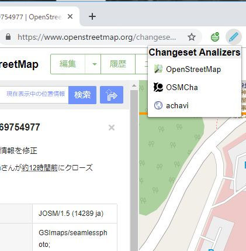

# OSMChangesetLeaper

Open OSMCha and achavi from OSM webpage

## Install
This extention uses Node.js
1. Install Node.js if needed
1. Install the dependencies: npm install
1. Build the extension: npm run build
1. The extension is built in the dist directory
1. Add to your Chrome/Firefox 

Screenshot of Chrome

